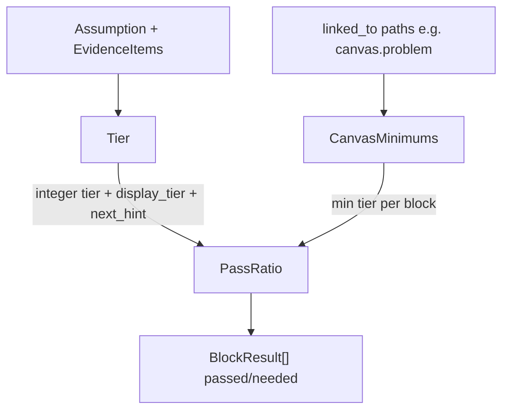

# Kalok Evidence System — Lean Canvas validation ladder

**I built a validation engine that enforces Blank/Dorf-inspired customer discovery thresholds — so founders stop pretending a confidence percentage is evidence.**

This is not the full Kalok app. Kalok is a founder operating system I’m building; this repo is a **portable extract** of its evidence core — the rule-gated ladder (E-0→E-4) and Lean Canvas PassRatio — so you can read the architecture, run the tests, and audit the methodology without wading through a private codebase.

---

## In 90 seconds

- **Architecture** — a climb engine (`Tier`), canvas floors (`CanvasMinimums`), and a scoreboard (`PassRatio`). Deterministic rules: no LLM “vibes,” no Rails in the core.
- **Runnable** — clone, `rake test` (25 cases), narrated CLI that climbs E-0→E-4 and prints PassRatio.
- **Methodology** — hear → observe → commit → retain as cumulative gates. Exact criteria. Oppose doesn’t pad floors. Contradiction caps climb at **E-1 max**. Emerging never “passes” a canvas block.

Skim: **problem → diagram → traps → sample output → run.**

```bash
bundle install && bundle exec rake test && ruby -Ilib examples/validate_lean_canvas.rb
```

---

## The problem

Founders love false precision:

> “We’re at 52% on problem.”

That number averages away the only questions that matter: interviewed on a *named* criterion? Behavior matched the story? Money changed hands? Customers stuck around?

A soft confidence % celebrates talk as traction and hides *what to do next*.

**What I optimized for:** force the next real test. Every assumption gets an engine tier, a display label, and a `next_hint`. Every Lean Canvas block gets `passed/needed` — not a mood.

---

## The insight

Blank/Dorf customer development for B2B is roughly: **hear → observe → commit → sustain**. Lean Canvas claims often skip steps. I encoded that sequence as **cumulative gates**, then mapped minimum engine tiers onto canvas blocks:

| Proof bar | Canvas blocks (defaults I chose for B2B v1) |
|-----------|-----------------------------------------------|
| E-1 Heard | problem, customer_segments |
| E-2 Observed | value_proposition, solution, channels, key_metrics |
| E-3 Committed | revenue_streams, cost_structure |
| E-4 Sustained | unfair_advantage |

These floors are **my B2B defaults** — inspired by Blank/Dorf and Lean Canvas discipline, **not** an official Blank/Dorf standard.

PassRatio asks: **how many non-abandoned linked assumptions meet that floor?** Risk does not shrink the denominator. Full locks and contracts: [docs/architecture.md](docs/architecture.md).

---

## Architecture

Three pure-Ruby modules. One job each.



- **Tier** — grades one assumption’s evidence. Exact `criterion_id`. Same inputs → same tier forever.
- **CanvasMinimums** — different canvas claims deserve different proof bars (“we hear the pain” ≠ “we have a moat”).
- **PassRatio** — honest scoreboard: `passed/needed` per block.

That separation keeps promotion rules auditable, the canvas scoreboard honest, and persistence out of the core.

Deep dive: [docs/architecture.md](docs/architecture.md).

---

## How tier promotion works

| Display | Engine | Meaning |
|---------|--------|---------|
| E-0 Untested | 0 | No qualifying signal on a confirmed criterion |
| E-0.5 Emerging | 0 | 2–4 supporting interviews — **never** passes a block |
| E-1 Heard | 1 | ≥5 supporting interviews on the **same** `criterion_id` |
| E-2 Observed | 2 | E-1 + behavioral / landing-page result |
| E-3 Committed | 3 | E-2 + ≥3 payments / deposits |
| E-4 Sustained | 4 | E-3 + ≥30-day retention |

Climb is **cumulative**. Higher kinds cannot skip the interview floor.

### The traps (where most “validation” tools lie)

1. **Oppose does not count toward floors** — only support advances; oppose creates contradiction.
2. **Split criteria do not combine** — three on `pain` + two on `acquisition` ≠ E-1.
3. **No skipping** — payment alone ≠ Committed; behavioral alone ≠ Observed.
4. **Contradiction caps climb at E-1 max** — money cannot outvote conflicted discovery.
5. **Emerging never passes a block** — progress for the UI; PassRatio uses integer `tier` only.

---

## PassRatio — honest canvas scoreboard

Two assumptions linked to `canvas.problem`: one at E-1, one empty → `1/2`, not “50% confidence.” Abandon the empty one and needed drops. Keep a low-risk myth linked without evidence and it still counts as incomplete work.

The scoreboard’s job is to name the **next experiment**, not inflate a percentage.

---

## What shipped

[`examples/validate_lean_canvas.rb`](examples/validate_lean_canvas.rb) climbs one B2B assumption cold-start → Sustained, then prints PassRatio:

```text
  [E-0 empty]                         engine=E-0 display=0   (Untested)
  [3 interviews → Emerging]           engine=E-0 display=0.5 (Emerging)
  [5 interviews → Heard (E-1)]        engine=E-1 display=1   (Heard)
  [Heard + behavioral → Observed]     engine=E-2 display=2   (Observed)
  [Observed + 3 payments → Committed] engine=E-3 display=3   (Committed)
  [Committed + 30d retention → E-4]   engine=E-4 display=4   (Sustained)

revenue_streams       min=E-3 (Committed)         0/1
  → Next: a_revenue is E-1 — run a behavioral test…
```

```bash
bundle install
bundle exec rake test          # 25 golden cases
ruby -Ilib examples/validate_lean_canvas.rb
```

API / IRB: [docs/architecture.md](docs/architecture.md#using-the-library).

---

## What this is / isn’t

| Is | Isn’t |
|----|-------|
| A portable **extract** of the evidence ladder from Kalok (a founder OS I’m building) | The full Kalok codebase (UI, agent, experiments, Stripe, secrets) |
| Deterministic Ruby core with golden tests and a CLI demo | A pitch deck, SaaS landing page, or unfinished dump |
| An evidence ladder you can audit in an afternoon | An LLM confidence score or “validation theater” |
| Open for reading, running, and reuse (MIT) | An invitation to buy the product |

**Docs:** [Architecture & locked decisions](docs/architecture.md) · **License:** MIT
