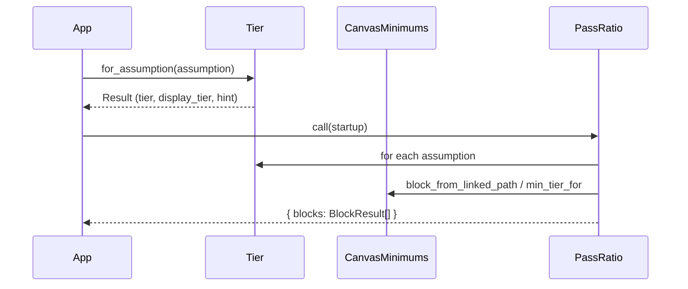
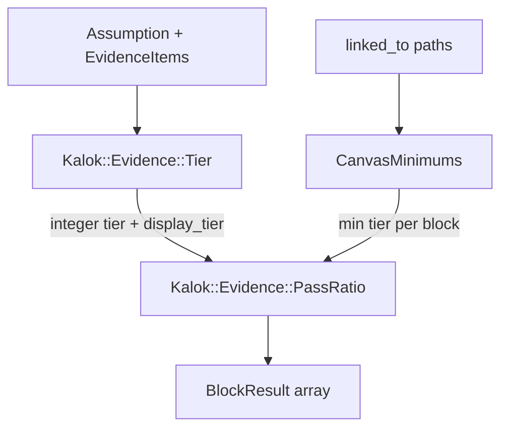

# Architecture — Evidence tiers + PassRatio

Narrative overview: [README.md](../README.md). This file is the technical reference for a **portable extract** of Kalok’s evidence core (not the full app): contracts, locked decisions, usage, and layout.

Pure Ruby — no Rails, no LLM. Namespace: `Kalok::Evidence::*`.

---

## Components

### `Kalok::Evidence::Tier`

Rule-gated ladder over one assumption’s `evidence_items`.

**Inputs** (duck-typed):

- `assumption.evidence_items` — enumerable with `kind`, optional `criterion_id` / `evidence_signal` / `criterion_status` / `occurred_on` / `detail_data`
- `as_of:` — `Date` for retention age (default `Date.today`)

**Outputs** (`Tier::Result`):


| Field                     | Role                                                               |
| ------------------------- | ------------------------------------------------------------------ |
| `tier`                    | Integer engine tier 0–4 — **only** value PassRatio uses for “pass” |
| `display_tier`            | May be `0.5` (Emerging) while engine stays `0`                     |
| `label`                   | Human label from `LABELS`                                          |
| `sub_status`              | `emergent` / `interviews_pending` / `behavioral_pending` / nil     |
| `criterion_id`            | Winning criterion for the best row                                 |
| `capped_by_contradiction` | Support + oppose on same criterion                                 |
| `next_hint`               | Founder-facing next action                                         |
| `basis`                   | Debug: per-criterion rows + unassigned count                       |


**Promotion** (cumulative — higher kinds cannot skip the interview floor):

1. **E-1** — ≥5 supporting interviews on the same exact `criterion_id`, no open contradiction
2. **E-2** — E-1 + behavioral or `landing_page_result`
3. **E-3** — E-2 + ≥3 `payment` items
4. **E-4** — E-3 + retention ≥30 days (`detail_data["retention_days"]` or `occurred_on` age)

Unlabeled non-interview evidence falls under `"default"`. Interviews without a criterion do not climb.

### `Kalok::Evidence::CanvasMinimums`

Static B2B floors by Lean Canvas field. Parses `linked_to` paths (`canvas.problem`, `canvas.channels[ch1]`, …). Unknown paths → `nil`.

### `Kalok::Evidence::PassRatio`

Aggregates a startup-like object with `assumption_records` (Array):

```
for each non-abandoned assumption
  resolve linked_to → canvas blocks
  Tier.for_assumption → integer tier
  passes = tier >= min_tier_for(block)
per block: passed / needed, remaining[], next_hint
```

No ActiveRecord — filter `status != "abandon"` in Ruby.

### POROs (`models.rb`)

`EvidenceItem`, `Assumption`, `Startup` — thin `Data.define` duck-types. Instances are frozen; rebuild with a new `evidence_items:` array when adding evidence. The CLI uses a mutable wrapper for live narration.

---

## Data flow







---

## Locked design decisions (v1)

Change only with golden-test updates. These locks encode how the ladder behaves — change them and the golden tests must move with them.

1. **Needed set** — all non-abandoned assumptions linked to the block. **Not** filtered by `risk`. Risk is a UI hint only.
2. **Criterion key** — exact `criterion_id` match only. No fuzzy free-text matching in v1.
3. **Emerging** — `display_tier: 0.5`, engine `tier` stays `0`. Triggered by 2–4 supporting interviews. **Never** passes a canvas block.
4. **E-1 Heard** — ≥5 supporting interviews on the same criterion, no open contradiction. Oppose does not count toward floors.
5. **Cumulative gates** — E-2 = E-1 + behavioral or `landing_page_result`; E-3 = E-2 + ≥3 payments; E-4 = E-3 + ≥30-day retention.
6. **Contradiction** — support + oppose on the same criterion caps climb at **E-1 max** (cannot promote above E-1); hint asks for N more interviews (default **N=2**).
7. **No confidence %** — PassRatio / CanvasMinimums use **integer** `tier` **only**.
8. **Retention / payment ingest** — manual evidence rows OK in v1 (no Stripe required).


### Canvas floors (full table)

B2B defaults used in this engine — inspired by Blank/Dorf, **not** an official Blank/Dorf standard:


| Canvas block      | Min tier      | Why                                     |
| ----------------- | ------------- | --------------------------------------- |
| problem           | E-1 Heard     | Pain must be heard from real customers  |
| customer_segments | E-1 Heard     | Who hurts must be named and interviewed |
| value_proposition | E-2 Observed  | Promise needs observed behavior         |
| solution          | E-2 Observed  | Solution claims need demos / usage      |
| channels          | E-2 Observed  | Reach must show action                  |
| key_metrics       | E-2 Observed  | Metrics should be behavior-backed       |
| revenue_streams   | E-3 Committed | Revenue claims need money / contracts   |
| cost_structure    | E-3 Committed | Cost bets near committed reality        |
| unfair_advantage  | E-4 Sustained | Moat talk needs sustained retention     |


### Why not confidence %?

Percentages invite false precision and average away contradiction. The ladder forces a next concrete test.

### Library adaptations (no Rails)

- `assumption_records` is an **Array** (no AR `.includes` / `.where`)
- Dates use `Date.today` (not ActiveSupport `Date.current`)
- No ActiveSupport — local `blank?` / `present?` helpers inside `Tier`

---

## Using the library

```bash
bundle exec irb -Ilib -rkalok/evidence
# or: ruby -Ilib -rkalok/evidence -e '...'
```

```ruby
require "kalok/evidence"

items = 5.times.map do |i|
  Kalok::Evidence::EvidenceItem.new(
    kind: "interview",
    criterion_id: "inventory_pain",
    evidence_signal: "support",
    occurred_on: Date.today,
    summary: "interview #{i}"
  )
end

assumption = Kalok::Evidence::Assumption.new(
  external_id: "a_pain",
  text: "Ops managers waste 8+ hours/week reconciling inventory",
  linked_to: ["canvas.problem"],
  evidence_items: items
)

result = Kalok::Evidence::Tier.for_assumption(assumption)
result.tier    # => 1
result.label   # => "Heard"
result.next_hint

startup = Kalok::Evidence::Startup.new(assumption_records: [assumption])
Kalok::Evidence::PassRatio.call(startup)[:blocks].each do |b|
  puts "#{b.block}: #{b.ratio_label} (floor E-#{b.min_tier})"
end
```

Narrated climb: [`examples/validate_lean_canvas.rb`](../examples/validate_lean_canvas.rb).

```bash
bundle exec rake test
ruby -Ilib examples/validate_lean_canvas.rb
```

---

## Folder map

```text
kalok-evidence-system/
├── README.md                          # start here
├── docs/architecture.md               # this file
├── examples/validate_lean_canvas.rb
├── lib/kalok/evidence/
│   ├── tier.rb
│   ├── canvas_minimums.rb
│   ├── pass_ratio.rb
│   ├── models.rb
│   └── version.rb
└── test/kalok/evidence/
    ├── tier_test.rb
    └── pass_ratio_test.rb
```

---

## Out of scope

This repo is the rule engine only — not the full Kalok app. Not included:

- Persistence, jobs, UI, agent prompts
- Fuzzy / LLM criterion clustering
- Stripe or analytics webhooks
- B2C / marketplace vertical multipliers
- Shrinking needed set by risk

